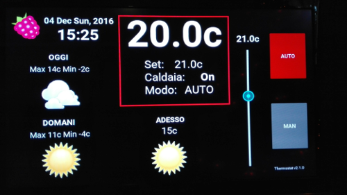
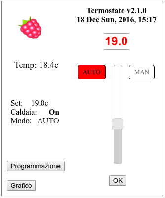

# Raspberry Pi - Cronotermostato

Autore: 	Jpnos
Email:		jpnos at gmx dot com
Licenza:	MIT
Traduzione: Painbrain di www.raspberryitaly.com

**IL SOFTWARE È FORNITO "COSI COM'È".SENZA GARANZIA DI NESSUN TIPO, ESPRESSA O IMPLICITA.**

-----------------------------------------------------------------------------------------------------------------------------------------

Questo progetto è una implementazione di un crono-termostato con un Raspberry Pi, progettato per funzionare su uno schermo LCD touch da 5". 

Caratteristiche incluse:

	1. Termostato visualizzabile e controllabile da display touch LCD da 5"
	2. Supporto alla programmazione con una schedulazione giornaliera e oraria della temperatura
	3. Inferfaccia web inclusa per controllare il sistema e modificare la programmazione attraverso qualsiasi browser
	4. Previsioni del tempo di oggi e domani a video tramite openweathermap.org
	5. Tutto il software può partire anche su una macchina con linux (es.ubuntu) per testarne la funzionalità usando una GPIO simulata
	6. Batteria di backup (optional)
	7. Supporto Celsius (default) o Farenheit
	8. Supporto alla calibrazione del sensore di temperatura
	9  Modalità stand-by con informazioni minime
	10. Log degli eventi dettagliato con livelli selezionabili di dettaglio, incluso grafico dei dati
	11. Accesso sicuro alla interfaccia web
	12. Possibilità di interfaccia con la mini stazione meteo Oregon Scientific EMR211

###Termostato Interfaccia Utente

**Termostato Interfaccia con Touch Screen:**

**Termostato Interfaccia minimale:**

**Termostato Interfaccia Web:**

**Termostato Web - Modifica Programmazione:**

**Note**: *Doppio click in un punto bianco della schedulazione per creare un nuovo cursore*

**Termostato Grafico:**

**Termostato Hardware - Interno:**

L'interno prima della chiusura col coperchio.

**Termostato Installazione:**

 Si può vedere il sensore di temperatura sulla destra... è fuori dal case perchè, se fosse interno, ilRaspberry Pi genererebbe calore durante il suo funzionamento ne altererebbe la misura della temperatura.

##Hardware (usato e testato dall'autore):

	- Raspberry Pi 2 Model B o Raspberry Pi 3
	- WiFi Adapter 150 Mbps (se con Pi 3 non necessario)
	- SunFounder Lab Modulo 2 Relè 5V
	- WINOMO DS18B20 Weatherproof temperature sensor
	- Makibes 5 Inch HDMI Touchscreen Display
	- Custom 3d abs printed thermostat enclosure
	- EMR211 Oregon Scientific (opzionale)
	- Bluetooth compatible adapter (opzionale)

##Requisiti Software (usati e testati dall'autore):

	- Sistema operativo Raspbian
	- Python 2.7
	- Kivy (Ver 1.9.2 dev) UI framework
	- Pacchetti aggiuntivi si Python:
	    - w1thermsensor
	    - FakeGPIO (Per testare in il sistema su computer che non siano Raspberry Pi)
	    - CherryPy (web server)
	    - schedule (per gli eventi schedulati)
		- bluepy
		- subprocess32
	    - openweathermap.org app key 
		

##Software installatione:

	1. Assicurati di avere l'ultima versione di Raspbian aggiornata
	2. Installa Kivy sul tuo Pi usando le istruzioni che trovi qui: http://www.kivy.org/docs/installation/installation-rpi.html
	3. Installa i pacchetti aggiuntivi si Python: CherryPy, schedule,bluepy,subprocess32 & w1thermsensor usando il comando "sudo pip install ..."
	4. Prendi la App Key di openweathermap.org, se non ce l'hai puoi averne una da qui: http://www.openweathermap.org/appid
	5. Modifica il file thermostat_settings.json e inserisci la App Key di OpenWeatherMap nell'opzione apposita. Inoltre puoi cambiare la locazione con la tua ricavandola da qui: http://openweathermap.org/help/city_list.txt

##Configurazione Hardware:

Il software è configurato per usare i seguenti pin GPIO di dafault:

	GPIO 4  - Sensore di Temperatura
	GPIO 27 - Relè di controllo per l'impianto di riscaldamento
	GPIO 18 - Relè di controllo della ventola di distribuzione aria (opzionale)
	GPIO 5  - PIR Sensore di movimento (opzionale)
 
Se vuoi usare pin differenti, basta cambiare gli opportuni valori nel file thermostat_settings.json. 

L'autore ha usato un Raspberry Pi 2 Model B per il suo termostato. Un Pi meno capace in termini di prestazioni potrebbe non rispondere adeguatamente ai comandi del touch e della interfaccia web.

##COME SI USA:
	AUTO :	La temperatura di set point cambia a seconda di come è impostata nella programmazione.
			cambiare la temperatura tramite lo slider fa' si che venga mantenuto il set impostato manualmente fino al successivo cambio di programmazione
		
	MAN :	Il set point della temperatura impostato dallo slider rimane mantenuto indifferentemente dalla programmazione
	
	No AUTO e No MAN : il set temp viene impostato a No Ice (no ghiaccio) (livello di temperatura impostabile nel file Setting.json)

##Calibrazione Sensore di Temperatura:

E' supportata la calibrazione del sensore di temperatua DS18B20 seguendo il metodo qui riportato: https://learn.adafruit.com/calibrating-sensors/two-point-calibration

Se vuoi calibrare il tuo DS18B20 (per farla serve un sensore a tenuta ermetica), devi trovare la tua altitudine (metri o piedi, dipende dalla misura) sul livello del mare, misurare la temperatura del ghiaccio e dell'acqua bollente e cambiare l'elevazione e le temperature appena dette nel file thermostat_settings.json.

I valori forniti di default nel file dei settaggi effettivamente non richiedono correzione, perciò puoi lasciarli così come sono se non puoi effettuare la calibrazione.

 
##Eseguire il codice del termostato: 

Puoi eseguire il codice in questi modi:

	sudo python thermostat.py

Ti serve il sudo perchè servono i privilegi di amministratore per operare con i pin GPIO.

Per avere il codice che parta automaticamente ad ogni avvio, puoi copiare il file resources/thermostat.desktop dentro /home/pi/.config/autostart/. Questo presuppone che tu abbia scaricato il codice del termostato in una cartella con nome /home/pi/thermostat. Se l'hai messo da qualche altra parte modifica il file e indica la posizione corretta.

Per accedere all'interfaccia web per controllare il termostato e cambiare la programmazione, semplicemente punta il tuo browser preferito all'IP del raspberry. Per esempio, il raspberry dell'autore ha un IP di 192.168.1.110, quindi basterà entrare in http://192.168.1.110 per accedere all'interfaccia.

##Sicurezza/autenticazione:
Nel file thermostat_setting.json
cambia user e password con quella che preferisci:
default:
user : termo
pass : pass

## Spegnimento dello schermo
Se hai uno schermo con relè per il controllo della retroilluminazione puoi decidere il tempo dopo il quale si spenga impostato il valore nel parametro lightOff nel file thermostat_settings.json

##Modo Interfaccia minimale (screensaver) mode: 

L'interfaccia minimale (screensaver) è abilitata di default. Questo modo ti permetterà di visualizzare la temperatura corrente con una luminosità dei caratteri più bassa dopo alcuni secondi di inattività. Per ripristinare l'interfaccia completa basta toccare lo schermo. Eventualmente la modalità screensaver si può disattivare nel file thermostat_settings.json. Il time-out di default è di un minuto ma si può cambiare col valore che si preferisce.

Opzionalmente si può usare un sensore PIR di rilevazione di movimento da usare come switch per riattivare il display se dovesse rilevare qualcuno. Questa funzione è disattivata di defualt, ma si può abilitare nel file delle impostazioni

Se vuoi usare il sensore PIR, puoi anche specifica un eventuale lasso di orario in cui ignorare il sensore. Questa opzione è utile per animali domestici quando non ci sei a casa o per evitare che nelle ore notturne si accenda se ci passi davanti.

##Logging:

E' implementato un sistema completo di log. La destinazione del log e il suo livello di dettaglio è impostabile nel file thermostat_settings.json

Include i seguenti canali di log:

	none  - no log
	file  - log nel file thermostat.log (default)
	print - log in sysout

Include i seguenti livelli di log:

	error - Log dei soli errori
	state - Log delle variazioni di stato del termostato (es. cambio di temperatura, cambio si stato, ecc) (default)
	info  - Log dettagliato di informazioni e settaggi (tanta roba!)
	debug - Log di informazioni di debug (veramente tantissima roba!)

Ogni livello di log include anche tutte le informazioni del livello precedente. Per esempio il livello info include anche tutte le informazioni del livello state e del livello error.
.

##Credits
Grazie a [chaeron ] (https://github.com/chaeron) che è lo sviluppatore che ha iniziato il progetto

Grazie a [athos/jpnos26](https://github.com/jpnos26) per lo sviluppo aggiuntivo del progetto attuale

Grazie a [Painbrain](www.raspberryitaly.com) per la localizzazione in italiano e il nuovo design grafico

Grazie a [Jeff - The Nooganeer](http://www.nooganeer.com/his/category/projects/homeautomation/raspberry-pi-thermostat/), ispiratore dell'hardware necessario al progetto.
 
Grazie a [Nich Fugal/Makeatronics](http://makeatronics.blogspot.com/2013/06/24v-ac-solid-state-relay-board.html) per il suo utilissimo 24V AC Solid State Relay Board.

##Additional Notes/Comments:

1. La temperatura è Celsius di default, una scala metrica. Si può cambiare impostandola in Farenheit, serve solo modificare il file di settaggi json con quello disponibile in resources/farenheit

2. Future versioni potrebbe includere la possibilità di comunicare con sensori di temperatura wireless, sistemi di analisi dei log, più sicurezza nell'autenticazione web e altro. Ma è un hobby, non un lavoro quindi con calma.

3. Siate liberi di modificare il codice, basta mantenere nei crediti la sorgente.Se lo fate vuol dire che avete familiarità con la programmazione di python, programmazione web e simili.

4. Le domande su implementazione e caratteristiche tecniche sono ben accette, anche suggerimenti per altre implementazioni da parte dell'autore.

Enjoy!

